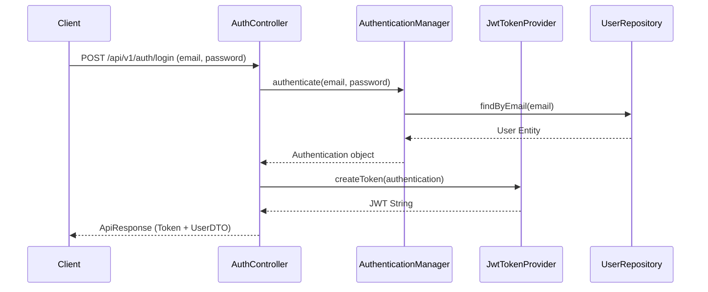
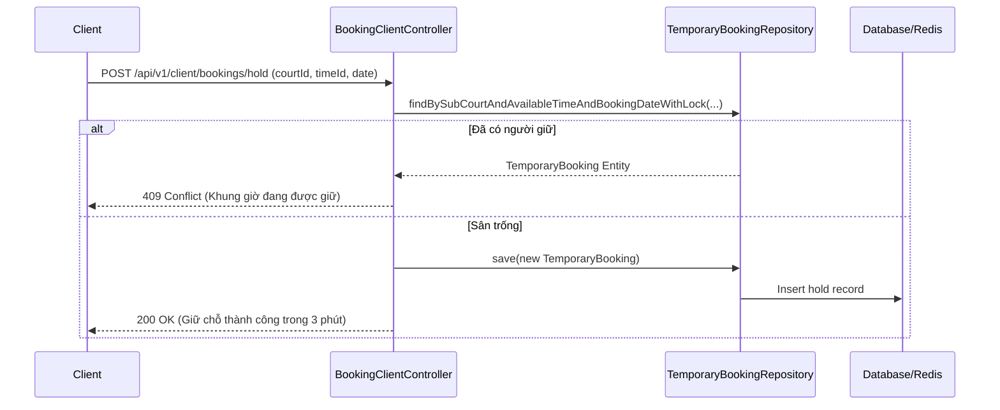
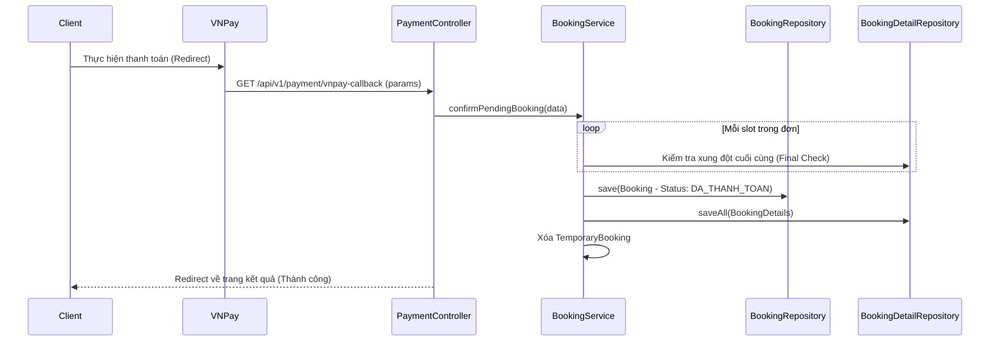
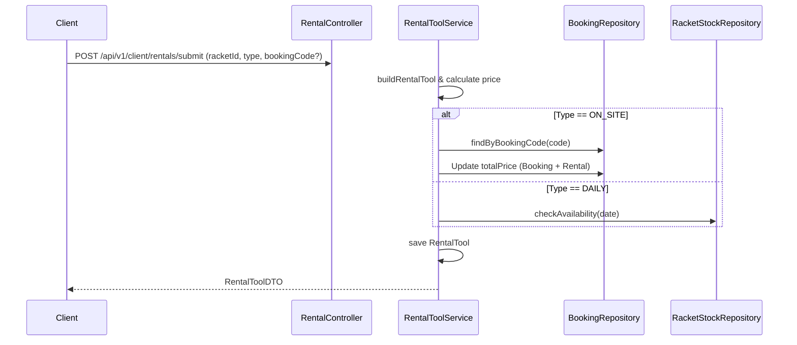

# Tài liệu Phân tích Thiết kế Hệ thống Pickleball Booking

Tài liệu này mô tả chi tiết kiến trúc, logic nghiệp vụ và các luồng xử lý (Sequence Diagrams) của dự án Pickleball Booking System dựa trên mã nguồn hiện tại.

---

## 1. Kiến trúc Tổng quan (System Architecture)
Hệ thống được xây dựng theo mô hình **Client-Server**:
- **Backend:** Spring Boot 3.x, Java 17.
- **Frontend:** Angular 21.
- **Database:** MySQL 8.0 (Sử dụng **Pessimistic Locking** để quản lý giữ chỗ tạm thời - Hold Slot).
- **Caching & Rate Limiting:** Redis (sử dụng để quản lý giới hạn tần suất yêu cầu - Rate Limit).
- **Communication:** RESTful API.

---

## 2. Sơ đồ Thực thể (Entity Analysis)
Dựa trên mã nguồn tại gói `domain`, các thực thể chính bao gồm:
- **User:** Lưu thông tin người dùng, phân quyền (ADMIN, STAFF, USER).
- **Product:** Thông tin sân pickleball chính (ví dụ: Sân pickleball Quận 1).
- **SubCourt:** Các sân con thuộc một Product (Sân 1, Sân 2...).
- **AvailableTime:** Các khung giờ có thể đặt (5:00 - 6:00, 6:00 - 7:00...).
- **Booking:** Đơn đặt sân, lưu thông tin tổng tiền, trạng thái thanh toán.
- **BookingDetail:** Chi tiết từng slot đặt (Sân nào, ngày nào, giờ nào).
- **RentalTool:** Đơn thuê vợt (theo ngày hoặc tại sân).

---

## 3. Phân tích Chức năng & Sequence Diagrams

### 3.1. Chức năng Đăng nhập (Authentication)
**Logic:** Sử dụng JWT (JSON Web Token) để xác thực.
1. User gửi email/password.
2. Backend kiểm tra thông tin trong DB qua `UserRepository`.
3. Nếu đúng, tạo JWT token chứa thông tin User và Roles.
4. Trả về token cho Client để lưu vào LocalStorage và gửi kèm các request sau qua Header `Authorization: Bearer <token>`.

---

### 3.2. Quy trình Đặt sân (Booking Flow - Phức tạp nhất)
Hệ thống sử dụng cơ chế **Hold-Slot** để tránh tình trạng nhiều người cùng đặt một sân tại một thời điểm.

#### Bước 1: Giữ chỗ tạm thời (Hold Court)
**Logic:** Khi User chọn sân và giờ, hệ thống ghi một bản ghi vào bảng `temporary_booking` trong **Cơ sở dữ liệu (MySQL)** và đặt thời gian bắt đầu giữ (`holdStartTime`). 
- Hệ thống sử dụng cơ chế **Pessimistic Locking** (`SELECT ... FOR UPDATE`) trong Repository để đảm bảo tại một thời điểm chỉ có một yêu cầu được xử lý cho cùng một slot sân/giờ, tránh tình trạng Race Condition.
- Thời gian giữ chỗ mặc định là **3 phút**. Nếu quá thời gian này mà User không thực hiện thanh toán, bản ghi sẽ được coi là hết hạn và người khác có thể chiếm chỗ.

#### Bước 2: Thanh toán và Xác nhận (Payment & Confirmation)
**Logic:** 
1. Sau khi giữ chỗ, User điền thông tin và bấm Thanh toán.
2. Hệ thống gọi `preparePendingBooking` để tính giá (có áp dụng `PricingService` cho giá linh hoạt) và lưu tạm vào `PendingBookingCache`.
3. Tạo URL thanh toán VNPay.
4. Sau khi User thanh toán thành công, VNPay gọi Callback tới Backend.
5. Backend gọi `confirmPendingBooking` để chính thức tạo đơn `Booking` và `BookingDetail` trong DB, đồng thời xóa `TemporaryBooking`.

---

### 3.3. Thuê vợt (Racket Rental)
Hệ thống hỗ trợ 2 loại hình:
- **DAILY (Thuê theo ngày):** Khách mang đi. Cần kiểm tra tồn kho theo ngày (`RacketStockByDate`).
- **ON_SITE (Thuê tại sân):** Khách thuê trực tiếp khi đang đánh. Logic sẽ yêu cầu nhập `Booking Code` để gắn tiền thuê vợt vào đơn đặt sân đó.

---

---

## 4. Các Logic Đặc biệt (Core Business Logic)

### 4.1. Pricing Service (Tính giá linh hoạt)
Hệ thống không chỉ lấy giá cố định mà còn tính toán dựa trên `BookingContext`:
- Giá theo khung giờ (Giờ vàng giá cao hơn).
- Giá theo ngày (Cuối tuần vs Ngày thường).
- Giảm giá thành viên (nếu có).

### 4.2. Quản lý Tồn kho Vợt (Racket Stock by Date)
Đối với thuê mang đi (DAILY), hệ thống lưu số lượng vợt còn lại cho từng ngày cụ thể trong bảng `racket_stock_by_date`. Khi có người thuê, số lượng `availableStock` sẽ giảm và `reservedStock` sẽ tăng.

---
*Tài liệu được phân tích dựa trên phiên bản mã nguồn ngày 01/05/2026.*
