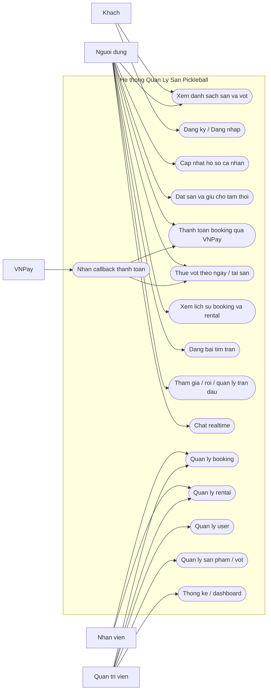

# Tai lieu du an Quan Ly San Pickleball

## 1. Gioi thieu tong quan

### 1.1. Ten du an

`quanly` - He thong quan ly San Pickleball, dat san, thue vot, ket noi tran dau va quan tri van hanh.

### 1.2. Muc tieu

Du an cung cap backend REST API cho cac nghiep vu chinh:

- Dang ky, dang nhap va xac thuc bang JWT.
- Quan ly thong tin nguoi dung va ho so ca nhan.
- Xem danh sach san, vot, thong tin chi tiet san pham.
- Dat san theo khung gio, co co che giu cho tam thoi.
- Ho tro dat san lap lai theo chu ky tuan.
- Thue vot theo hai hinh thuc: tai san va theo ngay.
- Thanh toan thong qua VNPay.
- Theo doi lich su dat san va lich su thue vot.
- Dang bai tim tran, tham gia tran, roi tran, loai nguoi choi khoi bai dang.
- Ho tro chat realtime qua WebSocket.
- Quan tri san pham, vot, nguoi dung, booking, rental va thong ke.

### 1.3. Pham vi he thong

He thong hien tai duoc thiet ke theo mo hinh `Spring Boot + REST API`, co cac nhom chuc nang:

- Public API cho khach va nguoi dung chua dang nhap.
- Protected API cho nguoi dung da dang nhap.
- Admin API cho nhan vien va quan tri vien.
- Realtime channel cho chat.
- Scheduled tasks de don du lieu va cap nhat trang thai.

## 2. Cong nghe va nen tang

### 2.1. Nen tang chinh

- Java 17
- Spring Boot 3.4.3
- Spring Web
- Spring Security
- Spring Data JPA
- Flyway
- MySQL
- WebSocket/STOMP
- Redis dependency (dang de san cho rate limit/cache, test da tach autoconfiguration)
- Bucket4j cho rate limiting
- WebClient/RestTemplate cho external integration

### 2.2. Thu vien va tich hop quan trong

- JWT (`jjwt`) cho xac thuc token
- MapStruct cho mapping DTO
- Lombok de giam boilerplate
- Spring Mail cho email
- VNPay cho thanh toan
- Web Push / ntfy cho notification
- H2 cho moi truong test

### 2.3. File cau hinh quan trong

- [pom.xml](/C:/Users/An/OneDrive/Documents/source/Persion/refactor_do_an/pom.xml)
- [application.properties](/C:/Users/An/OneDrive/Documents/source/Persion/refactor_do_an/src/main/resources/application.properties)
- [QuanlyApplication.java](/C:/Users/An/OneDrive/Documents/source/Persion/refactor_do_an/src/main/java/com/example/quanly/QuanlyApplication.java)

## 3. Kien truc he thong

### 3.1. Kien truc tong the

He thong theo mo hinh backend REST API, to chuc thanh cac lop:

1. `controller`
   - Nhan request HTTP
   - Validate input
   - Tra ve `ApiResponse`

2. `service`
   - Xu ly nghiep vu
   - Dieu phoi transaction
   - Tich hop thanh toan, email, goi y, thong bao

3. `repository`
   - Truy van du lieu thong qua Spring Data JPA

4. `domain`
   - Entity va enum nghiep vu

5. `domain.dto`
   - Request/response DTO cho API

6. `config`
   - Security, JWT, WebSocket, WebClient, VNPay, MVC

### 3.2. So do kien truc logic

```text
Client Web/Mobile
    |
    v
REST Controllers / WebSocket Endpoints
    |
    v
Service Layer
    |
    +--> Payment / Email / Notification / Recommendation / RateLimit
    |
    v
Repository Layer
    |
    v
MySQL / Flyway Schema
```

### 3.3. Entry point

Application boot tai:

- [QuanlyApplication.java](/C:/Users/An/OneDrive/Documents/source/Persion/refactor_do_an/src/main/java/com/example/quanly/QuanlyApplication.java)

Class nay:

- Bat `@SpringBootApplication`
- Bat `@EnableScheduling`
- Bat `@EnableAsync`

Dieu nay cho thay he thong co su dung:

- Scheduled jobs
- Async processing

## 4. Cau truc ma nguon

### 4.1. Thu muc chinh

```text
src/main/java/com/example/quanly
|-- config
|-- controller
|   |-- admin
|   |-- client
|-- domain
|   |-- dto
|   |-- utility
|-- mapper
|-- repository
|-- scheduler
|-- service
|   |-- pricing
|   |-- spectification
|   |-- validator
```

### 4.2. Cac nhom domain chinh

Entity nghiep vu cot loi:

- `User`
- `Role`
- `Product`
- `SubCourt`
- `AvailableTime`
- `Booking`
- `BookingDetail`
- `TemporaryBooking`
- `Racket`
- `RacketStockByDate`
- `RentalTool`
- `MatchPost`
- `MatchParticipant`
- `ChatMessage`
- `PasswordResetToken`

Enum/nghiep vu:

- `BookingStatus`
- `BookingType`
- `RentalToolStatus`
- `RentalType`
- `PaymentMethod`
- `PaymentType`

## 5. Doi tuong su dung va use case tong quat

### 5.1. Tac nhan

- `Khach`
  - Chua dang nhap
  - Co the xem thong tin san pham cong khai

- `Nguoi dung`
  - Da dang ky va dang nhap
  - Dat san, thue vot, tim tran, chat, xem lich su

- `Nhan vien`
  - Quan ly booking va rental

- `Quan tri vien`
  - Quan tri toan bo he thong

- `VNPay`
  - He thong thanh toan ngoai

### 5.2. Bieu do use case tong quat



## 6. Chuc nang chi tiet theo module

### 6.1. Xac thuc va tai khoan

Controller:

- [AuthController.java](/C:/Users/An/OneDrive/Documents/source/Persion/refactor_do_an/src/main/java/com/example/quanly/controller/AuthController.java)
- `ForgotPasswordController`

Chuc nang:

- Dang ky tai khoan
- Dang nhap lay JWT
- Quen mat khau
- Dat lai mat khau
- Doi mat khau
- Cap nhat profile

API chinh:

- `POST /api/v1/auth/login`
- `POST /api/v1/auth/register`
- `POST /api/v1/auth/forgot-password`
- `POST /api/v1/auth/reset-password`
- `GET /api/v1/client/profile`
- `PUT /api/v1/client/profile`
- `PUT /api/v1/client/change-password`

### 6.2. San pham va San Pickleball

Controller:

- [ItemController.java](/C:/Users/An/OneDrive/Documents/source/Persion/refactor_do_an/src/main/java/com/example/quanly/controller/client/ItemController.java)
- `ProductController`
- `RacketController`
- `RacketStockByDateController`

Chuc nang:

- Xem danh sach san
- Tim kiem va loc san theo dia chi/gia/sap xep
- Xem chi tiet san
- Xem danh sach vot
- Loc vot theo hang, gia, sort
- Quan ly san pham va vot tu phia admin

API client chinh:

- `GET /api/v1/products`
- `GET /api/v1/products/{productId}`
- `GET /api/v1/rackets`
- `GET /api/v1/rackets/{racketId}`

API admin chinh:

- `GET/POST/PUT/DELETE /api/v1/admin/products`
- `GET/POST/PUT /api/v1/admin/rackets`
- `POST /api/v1/racket-stock`

### 6.3. Dat san

Controller:

- [BookingClientController.java](/C:/Users/An/OneDrive/Documents/source/Persion/refactor_do_an/src/main/java/com/example/quanly/controller/client/BookingClientController.java)
- `BookingController`

Service chinh:

- `BookingService`
- `RecommendationService`
- `TemporaryBookingCleaner`

Chuc nang:

- Lay thong tin dat san theo san
- Kiem tra khung gio con trong
- Goi y khung gio theo lich su nguoi dung
- Giu cho tam thoi de tranh trung lich
- Dat san 1 lan hoac dat lap lai theo tuan
- Sinh payment URL de thanh toan dat coc qua VNPay
- Xem lich su booking
- Xem chi tiet booking

API chinh:

- `GET /api/v1/client/bookings/recommend/{productId}`
- `GET /api/v1/client/bookings/{productId}/info`
- `GET /api/v1/client/bookings/available-times`
- `POST /api/v1/client/bookings/hold`
- `POST /api/v1/client/bookings/place`
- `GET /api/v1/client/booking-history`
- `GET /api/v1/client/booking-history/{id}`

### 6.4. Thue vot

Controller:

- `RentalController`
- `RentalToolController`

Service chinh:

- `RentalToolService`
- `RentalPricingService`
- `RacketStockByDateService`

Chuc nang:

- Tao don thue vot theo ngay
- Tao don thue vot tai san
- Tinh gia tu backend
- Thanh toan cho don thue
- Tru ton kho va quan ly stock theo ngay
- Theo doi lich su thue vot
- Admin cap nhat trang thai don thue

API chinh:

- `POST /api/v1/rentals`
- `POST /api/v1/rentals/{id}/pay`
- `GET /api/v1/client/rental-history`
- `GET /api/v1/admin/rentals`
- `GET /api/v1/admin/rentals/{id}`
- `PUT /api/v1/admin/rentals/{id}/status`

### 6.5. Thanh toan

Controller:

- [PaymentController.java](/C:/Users/An/OneDrive/Documents/source/Persion/refactor_do_an/src/main/java/com/example/quanly/controller/PaymentController.java)

Service:

- `PaymentService`

Chuc nang:

- Tao URL thanh toan VNPay
- Xac thuc chu ky callback VNPay
- Xu ly callback cho booking
- Xu ly callback cho rental

API chinh:

- `GET /api/v1/payments/vnpay-callback`

### 6.6. Match-post va chat

Controller:

- [MatchPostController.java](/C:/Users/An/OneDrive/Documents/source/Persion/refactor_do_an/src/main/java/com/example/quanly/controller/client/MatchPostController.java)
- `ChatSocketController`

Service:

- `MatchPostService`
- `MatchParticipantService`
- `ChatService`

Chuc nang:

- Tao bai tim tran
- Tim kiem bai dang theo khu vuc, ngay, trinh do
- Tham gia tran
- Roi tran
- Chu bai dang kick thanh vien
- Huy bai dang
- Lay lich su chat
- Chat realtime qua WebSocket

API chinh:

- `GET /api/v1/match-posts`
- `GET /api/v1/match-posts/{id}`
- `POST /api/v1/match-posts`
- `POST /api/v1/match-posts/{id}/join`
- `POST /api/v1/match-posts/{id}/leave`
- `POST /api/v1/match-posts/{id}/cancel`
- `POST /api/v1/match-posts/{postId}/kick/{userId}`
- `GET /api/v1/chat/history/{chatRoomId}`

### 6.7. Quan tri va thong ke

Controller:

- `DashboardController`
- `UserController`
- `ProductController`
- `BookingController`
- `RentalToolController`
- `RacketStatisticsController`

Chuc nang:

- Dashboard quan tri
- Quan ly user
- Quan ly role
- Quan ly booking
- Quan ly rental
- Quan ly san pham
- Quan ly vot
- Thong ke doanh thu
- Thong ke vot duoc su dung

## 7. Bao mat va phan quyen

Controller cau hinh:

- [SecurityConfiguration.java](/C:/Users/An/OneDrive/Documents/source/Persion/refactor_do_an/src/main/java/com/example/quanly/config/SecurityConfiguration.java)
- `JwtAuthenticationFilter`
- `JwtTokenProvider`

### 7.1. Co che xac thuc

- Dang nhap tra ve JWT
- Client gui `Authorization: Bearer <token>`
- Filter JWT doc token, validate va dua user vao SecurityContext
- He thong theo `STATELESS session`

### 7.2. Endpoint cong khai

Theo cau hinh hien tai, mot so endpoint public:

- `/api/v1/auth/**`
- `/api/v1/products/**`
- `/api/v1/rackets/**`
- `/api/v1/client/home`
- `/api/v1/racket-stock/**`
- `/api/v1/ntfy-sse/**`
- `/api/v1/payments/vnpay-callback`
- `/ws/**`

### 7.3. Phan quyen

- `USER`
  - Dat san
  - Thue vot
  - Tim tran
  - Xem lich su

- `STAFF`
  - Xem va cap nhat booking/rental

- `ADMIN`
  - Toan quyen admin module

## 8. Mo hinh du lieu nghiep vu

### 8.1. Nhom nguoi dung

- `User`
- `Role`
- `PasswordResetToken`

### 8.2. Nhom san va dat san

- `Product`: dai dien san/cum san
- `SubCourt`: san con thuoc mot product
- `AvailableTime`: khung gio
- `Booking`: phieu dat san tong
- `BookingDetail`: chi tiet tung slot dat san
- `TemporaryBooking`: du lieu giu cho tam thoi

### 8.3. Nhom vot va thue vot

- `Racket`
- `RacketStockByDate`
- `RentalTool`

### 8.4. Nhom ket noi tran dau

- `MatchPost`
- `MatchParticipant`
- `ChatMessage`

### 8.5. Quan he tong quat

```text
User 1 - n Booking
Booking 1 - n BookingDetail
Product 1 - n SubCourt
SubCourt n - n AvailableTime
Product 1 - n Racket
Racket 1 - n RacketStockByDate
User 1 - n RentalTool
User 1 - n MatchPost
MatchPost 1 - n MatchParticipant
MatchPost 1 - n ChatMessage
```

## 9. Luong nghiep vu chinh

### 9.1. Dang nhap

1. Client gui email/password
2. `AuthController` goi `AuthenticationManager`
3. Xac thuc thanh cong thi tao JWT
4. Tra ve token + role

### 9.2. Dat san

1. User xem thong tin san va khung gio trong
2. User goi API `hold` de giu cho tam thoi
3. He thong lock va kiem tra xung dot
4. User goi API `place`
5. `BookingService` tao booking va chi tiet booking
6. `PaymentService` tao payment URL VNPay
7. VNPay callback quay ve backend
8. `PaymentController` xac thuc chu ky
9. Booking duoc cap nhat trang thai thanh toan

### 9.3. Thue vot theo ngay

1. User tao rental request
2. Backend tinh gia va validate stock
3. Rental luu o trang thai `PENDING`
4. User thanh toan
5. Callback thanh toan hop le
6. Backend tru stock va cap nhat rental

### 9.4. Dang bai tim tran

1. User tao match post
2. Nguoi khac tim kiem va tham gia
3. Chu bai dang co the kick hoac huy bai dang
4. Chat realtime thong qua STOMP WebSocket

## 10. Realtime, scheduler va tac vu nen

### 10.1. WebSocket

File cau hinh:

- [WebSocketConfig.java](/C:/Users/An/OneDrive/Documents/source/Persion/refactor_do_an/src/main/java/com/example/quanly/config/WebSocketConfig.java)

Thong so:

- STOMP endpoint: `/ws`
- Broker prefixes: `/topic`, `/queue`
- App destination prefix: `/app`
- User destination prefix: `/user`

### 10.2. Scheduled tasks

He thong co cac scheduled jobs:

- `TemporaryBookingCleaner`
  - Chay dinh ky de xoa giu cho het han

- `MatchPostScheduler`
  - Cap nhat bai dang tran dau het han

- `RentalToolService#updateRentalStockForToday`
  - Dong bo stock rental theo ngay

## 11. Notification, email va external integration

### 11.1. Email

Service:

- `EmailService`

Su dung cho:

- Dat lai mat khau
- Xac nhan booking

### 11.2. Notification

Service:

- `NotificationService`
- `NtfyService`

Controller:

- `NtfyController`

Co che:

- SSE endpoint
- Push notification
- ntfy integration

### 11.3. Recommendation

Service:

- [RecommendationService.java](/C:/Users/An/OneDrive/Documents/source/Persion/refactor_do_an/src/main/java/com/example/quanly/service/RecommendationService.java)

Co che:

- Tim khung gio nguoi dung dat nhieu nhat
- Uu tien khung gio yeu thich hoac khung gio buoi toi
- Chi de xuat slot chua bi dat

## 12. Database va migration

### 12.1. Co so du lieu

Moi truong chay that su dung MySQL.

Cau hinh hien tai:

- host: `localhost`
- port: `3307`
- db: `sanpickleball1`

### 12.2. Flyway

Migration nam tai:

- [src/main/resources/db/migration](/C:/Users/An/OneDrive/Documents/source/Persion/refactor_do_an/src/main/resources/db/migration)

Tinh trang:

- `V1__init_schema.sql`: hien dang la file baseline placeholder
- `V2__add_member_level_to_users.sql`
- `V3__add_recurring_booking_to_booking.sql`

Luu y:

- V1 hien chua chua full schema SQL xuat tu database.
- Neu dua du an vao moi truong moi, can xac nhan lai chien luoc baseline/migration de tranh sai lech schema.

## 13. Cau hinh ung dung

### 13.1. Cau hinh chay chinh

File:

- [application.properties](/C:/Users/An/OneDrive/Documents/source/Persion/refactor_do_an/src/main/resources/application.properties)

Noi dung quan trong:

- DataSource MySQL
- Flyway
- Multipart upload
- VNPay
- Mail
- JWT
- CORS
- Redis
- Forward headers

### 13.2. Moi truong test

File:

- `src/test/resources/application-test.properties`

Dac diem:

- Dung H2 in-memory
- Tat Flyway
- Exclude Redis auto configuration
- Dummy config cho JWT, VNPay, Mail, VAPID

## 14. Chien luoc test

### 14.1. Test hien co

Files:

- `QuanlyApplicationTests`
- `SecurityTests`

### 14.2. Muc tieu test hien tai

- Kiem thu boot context
- Kiem thu security 401/403
- Kiem thu validation 400
- Kiem thu public endpoint
- Kiem thu callback VNPay chu ky khong hop le

### 14.3. Huong mo rong test

Nen bo sung:

- Integration test cho booking success
- Integration test cho rental success
- Test callback thanh toan hop le
- Test business flow stock update
- Test migration schema bang Flyway that

## 15. Huong dan khoi dong

### 15.1. Dieu kien

- Java 17
- Maven Wrapper
- MySQL

### 15.2. Chay local

1. Tao database MySQL:

```sql
CREATE DATABASE sanpickleball1;
```

2. Chinh lai `application.properties` neu can:

- `spring.datasource.url`
- `spring.datasource.username`
- `spring.datasource.password`

3. Chay ung dung:

```powershell
./mvnw.cmd spring-boot:run
```

### 15.3. Chay test

```powershell
./mvnw.cmd test
```

## 16. Danh sach API tong quan

### 16.1. Public API

- `POST /api/v1/auth/login`
- `POST /api/v1/auth/register`
- `POST /api/v1/auth/forgot-password`
- `POST /api/v1/auth/reset-password`
- `GET /api/v1/products`
- `GET /api/v1/products/{id}`
- `GET /api/v1/rackets`
- `GET /api/v1/rackets/{id}`
- `GET /api/v1/client/home`
- `GET /api/v1/payments/vnpay-callback`
- `GET /api/v1/ntfy-sse/{topic}`

### 16.2. User API

- Booking
- Rental
- Profile
- Match-post
- Chat history
- Booking history
- Rental history

### 16.3. Admin API

- Dashboard
- User management
- Product management
- Racket management
- Booking management
- Rental management
- Revenue/statistics

## 17. Diem manh hien tai

- Da di theo huong REST API ro rang
- Co JWT stateless auth
- Da co profile test tach rieng
- Da co callback payment tach rieng
- Da co validation request va test security/validation
- He thong nghiep vu da bao phu nhieu bai toan thuc te

## 18. Gioi han va de xuat phat trien tiep

### 18.1. Gioi han hien tai

- V1 Flyway schema chua hoan chinh
- Nhieu controller van tra response map dong thay vi DTO response chuan hoa
- Business rule validation theo context van co the tang cuong them
- Scheduler va stock logic nen co them integration tests

### 18.2. De xuat cai tien

- Chuan hoa DTO response cho moi endpoint
- Tiep tuc tach service theo use-case nho hon
- Tang cuong migration strategy cho moi truong moi
- Bo sung observability/logging co cau truc
- Tich hop OpenAPI/Swagger de sinh tai lieu API tu dong

## 19. Ket luan

Du an `quanly` la backend REST API phuc vu quan ly San Pickleball va cac nghiep vu lien quan nhu dat san, thue vot, thanh toan, tim tran va quan tri he thong. Kien truc hien tai phu hop de tiep tuc mo rong thanh mot backend cho web frontend, mobile app hoac he thong van hanh noi bo.

Tai lieu nay duoc tong hop tu ma nguon hien tai trong repository. Neu co thay doi lon o API, schema hoac business flow, can cap nhat lai tai lieu de dong bo voi code.
